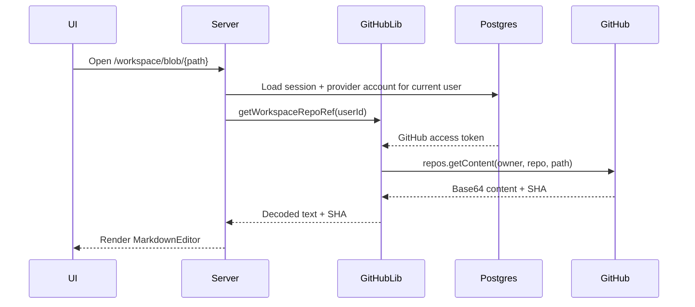
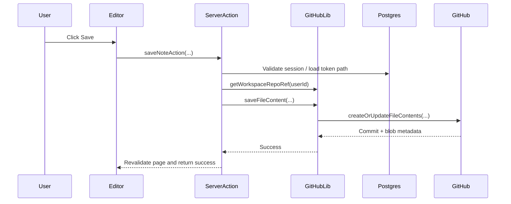

# GitHub File Storage

## Scope

This document explains how `note-app` uses GitHub as its content store, what the current storage flow is, and where the design needs to evolve.

## Core design choice

The app does not store note bodies in PostgreSQL. Instead, it stores notes as files inside a GitHub repository and uses GitHub commits as the version history.

That means:

- GitHub is the source of truth for note content.
- PostgreSQL is only used for auth and provider-account persistence.
- every save becomes a Git commit on the repository default branch

## Current repository model

When a user enters `/workspace`, the app resolves the current user's dedicated workspace repository on the server.

Behavior:

- it loads the authenticated GitHub user
- it looks for a repository named `note-app-workspace`
- if the repository does not exist, it creates a private repo with `auto_init: true`
- it keeps the repository identity server-side and exposes canonical workspace routes like `/workspace`, `/workspace/new`, and `/workspace/blob/{path}`

Implementation notes:

- `getOrCreateWorkspaceRepo(userId)` still provisions or loads the physical GitHub repository
- `getWorkspaceRepoRef(userId)` returns the resolved `{ owner, repo }` pair for internal GitHub API calls
- route handlers and server actions now derive the repository from the session instead of trusting `owner` and `repo` from the URL

This makes onboarding simple for a single-user personal workspace.

## Current GitHub integration surface

All GitHub storage logic is centralized in `lib/github.ts`.

Implemented functions:

- `getUserRepositories(userId)`
- `getRepositoryContents(userId, owner, repo, path?)`
- `getFileContent(userId, owner, repo, path)`
- `saveFileContent(userId, owner, repo, path, content, message, sha?)`
- `getOrCreateWorkspaceRepo(userId)`
- `getWorkspaceRepoRef(userId)`

Workspace-specific access is now centralized in `app/workspace/actions.ts`, which resolves the authenticated user's workspace repo before reading or writing content.

## File read flow

### Implementation details

- route params contain only the file path, not the repository identity
- the server resolves `owner` and `repo` from the current session before calling GitHub
- directory listings come from `repos.getContent(...)` with a directory path
- file reads come from the same endpoint with a file path
- file content is decoded from Base64 to UTF-8 in `getFileContent(...)`
- the returned Git blob SHA is kept so later updates can be optimistic and version-aware

## File save flow

### Implementation details

- new files can be created without a SHA
- updates include the previous file SHA
- content is Base64-encoded before the API call
- commit messages are simple strings like `Create docs/architecture.md` or `Update docs/architecture.md`
- after save, the app revalidates `/workspace` and `/workspace/blob/{path}`

## Repository browsing

The repository tree UI in `components/file-tree.tsx` is intentionally lazy:

- root contents are loaded in the repository layout
- folders fetch children only when expanded
- directories are sorted before files
- markdown files are visually emphasized in the tree

This keeps the initial repository payload relatively small for simple repositories.

## Strengths of the current design

- zero custom content schema for notes
- GitHub commit history provides built-in versioning
- content stays portable and user-owned
- note paths naturally map to folders and repository structure
- the app can read any markdown file already in the repo

## Weaknesses and design constraints

### 1. Save conflicts are not handled in the UI

The code sends a SHA on update, which is correct, but there is no conflict-resolution experience if GitHub returns a `409`.

### 2. Default-branch only

The save flow does not expose branch selection. All edits land on the repository default branch.

### 3. No delete, rename, or move support

The app currently supports create and update only.

### 4. No metadata index

There is no secondary index for:

- backlinks
- tags
- note types
- file search
- AI retrieval
- note-to-diagram relationships

### 5. Repository identity is path-based

The GitHub API layer still uses `{owner, repo}` and file path strings internally. Those are human-readable, but they are not the most durable identifiers if repository names change.

The app route model no longer exposes `{owner}/{repo}` in workspace URLs. That removes repository selection from the browser address bar, but it does not solve long-term identity durability by itself.

### 6. OAuth token blast radius

Because the app uses OAuth `repo` scope, the token can reach more than the single workspace repository unless the user explicitly restricts behavior at the app level.

The current app now reduces accidental cross-repo access by always resolving the workspace repository on the server for workspace routes and server actions. However, the OAuth token itself is still broader than the single workspace repository.

### 7. Legacy routes still exist as redirects

The old `/workspace/{owner}/{repo}` route shape has been demoted to compatibility redirects into the canonical `/workspace` routes.

That means:

- old deep links can still land in the workspace
- repository identity is no longer user-controlled through the workspace URL
- true least privilege still requires auth model changes, not just route changes

## Current code assumptions

- file content is text and can be decoded as UTF-8
- GitHub is reachable and the token is valid
- the server resolves all workspace reads and writes against the current user's dedicated workspace repository
- saves are serialized by user behavior
- the repo is not empty when browsing begins, which is why workspace creation uses `auto_init: true`

## Recommended storage evolution

### Short term

1. Add rename/delete/move operations.
2. Add retry and clearer conflict messaging around GitHub `409` responses.
3. Persist repository IDs and maybe default branch names in a local table.
4. Remove the legacy compatibility routes once the new canonical URLs are fully rolled out.
5. Restrict editing to a configured repository list instead of any repo the token can access.

### Medium term

1. Add a content index table keyed by repository ID + path + SHA.
2. Parse markdown on save to extract headings, links, tags, backlinks, and note type.
3. Add background sync so GitHub changes made outside the app can be indexed.

### Long term

1. Migrate to GitHub App auth for least-privilege repository access.
2. Support branch-based edit sessions and optional pull requests.
3. Add asset storage workflows for images and future diagram exports.

## What official docs say that matters here

- GitHub's Contents API returns file content Base64-encoded.
- The update API requires the previous blob SHA when replacing a file.
- GitHub warns that create/update and delete operations should be performed serially to avoid conflicts.
- OAuth app tokens need the `repo` scope for private repository content writes.

## External references

- GitHub Contents API: https://docs.github.com/en/rest/repos/contents
- GitHub OAuth scopes: https://docs.github.com/en/apps/oauth-apps/building-oauth-apps/scopes-for-oauth-apps
- GitHub OAuth app best practices: https://docs.github.com/en/enterprise-cloud@latest/apps/oauth-apps/building-oauth-apps/best-practices-for-creating-an-oauth-app
